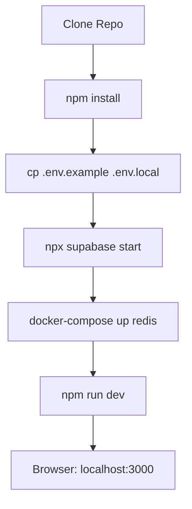
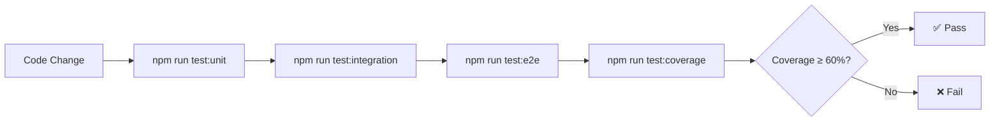
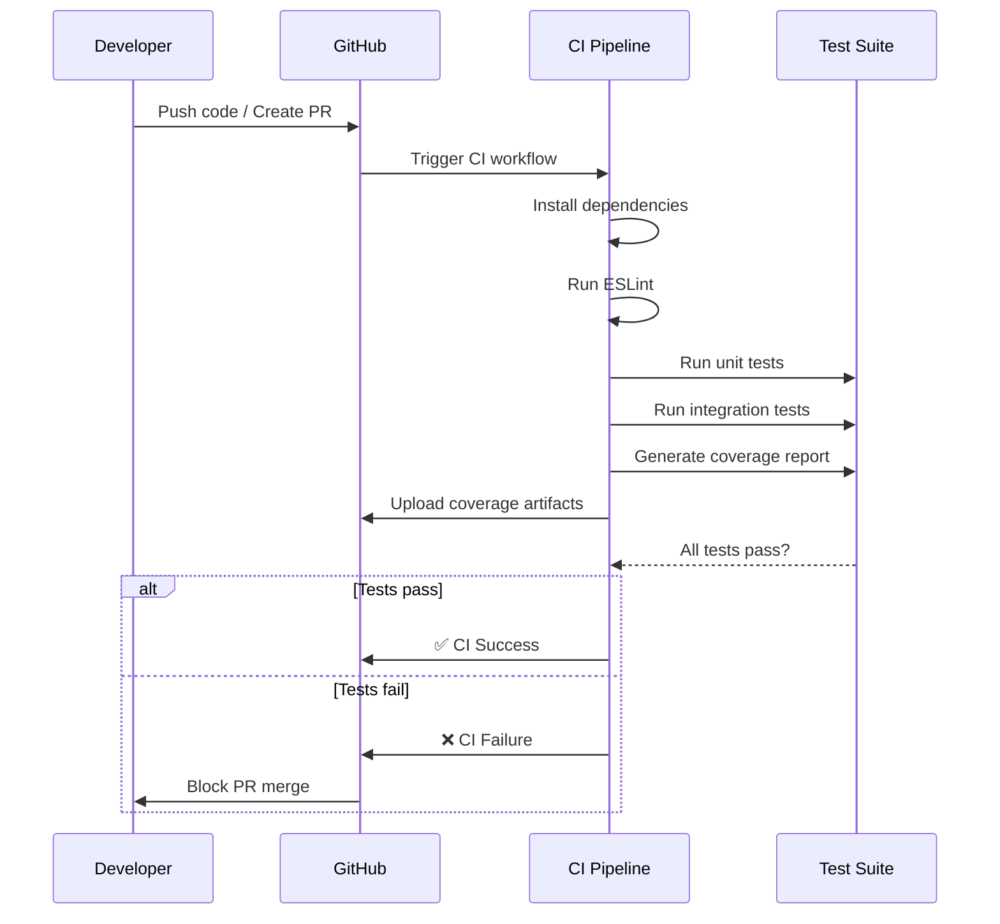
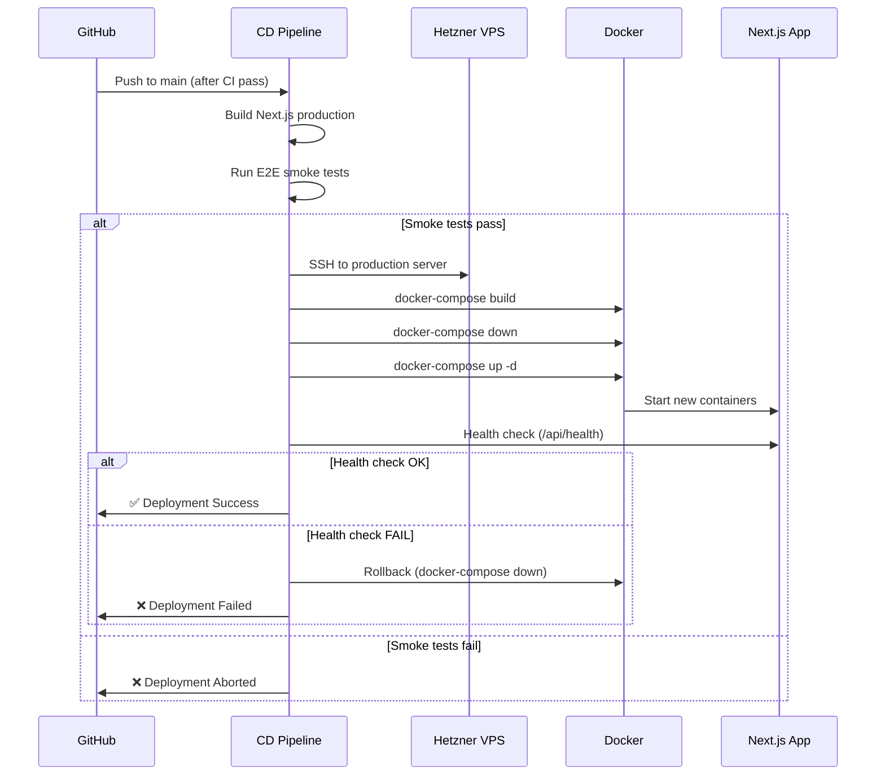
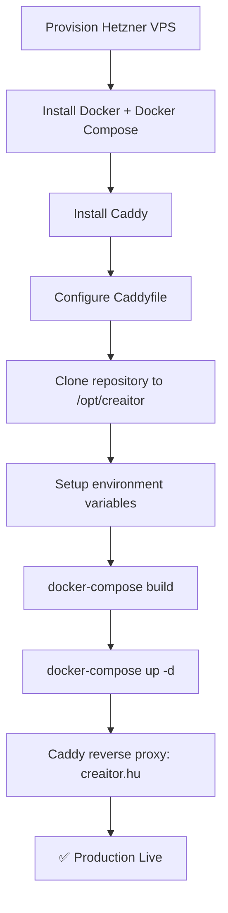

# Epic Technical Specification: Foundation & Development Infrastructure

Date: 2025-11-19
Author: BMad
Epic ID: 1
Status: Draft

---

## Overview

Az **Epic 1: Foundation & Development Infrastructure** a Creaitor projekt technikai alapjainak megalapozását célozza, amely minden további fejlesztést lehetővé tesz. Ez az epic biztosítja a zökkenőmentes fejlesztői környezetet, a CI/CD pipeline-t, a deployment infrastruktúrát és az alapvető eszközöket.

**Üzleti érték:** Nulla súrlódású fejlesztői környezet → gyorsított fejlesztési sebesség az összes későbbi epichez. A megfelelő infrastruktúra és eszközök biztosításával a csapat hatékonyan tud dolgozni, és a későbbi epicek implementálása sokkal gyorsabb és megbízhatóbb lesz.

**Kapcsolódás a PRD-hez:** Ez az epic közvetlenül támogatja a projekt technikai architektúráját (TA0-TA6 szekciók) és biztosítja, hogy a fejlesztés megfeleljen az NFR követelményeknek (különösen NFR6: Maintainability, NFR8: Deployment & DevOps).

## Objectives and Scope

### Objectives

1. **Standardizált fejlesztői környezet létrehozása:** Next.js 15 projekt inicializálása TypeScript-tel, Tailwind CSS-sel és core dependenciákkal
2. **Supabase infrastruktúra beállítása:** Lokális és cloud Supabase környezet konfigurálása PostgreSQL adatbázissal, Auth szolgáltatással és Storage-dzsel
3. **Docker-alapú fejlesztői környezet:** Docker Compose konfiguráció a szolgáltatások (Next.js, Redis, Supabase) konzisztens futtatásához
4. **Test infrastruktúra:** Jest unit/integration tesztek és Playwright E2E tesztek beállítása
5. **Structured logging:** Winston logger konfigurálása esemény- és hibakövetéshez
6. **Reverse proxy és HTTPS:** Caddy automatikus HTTPS-sel a production deploymenthez
7. **CI/CD pipeline:** GitHub Actions automatizált teszteléshez és deploymenthez
8. **Frontend design system:** Tailwind CSS konfigurálás purple/violet színpalettával, Shadcn UI komponensekkel és design token rendszerrel
9. **Layout és navigáció:** Főbb layout komponensek (Sidebar, TopBar, MainLayout) és navigációs setup Brand Selector-ral

### In Scope

- **Story 1.1:** Project initialization (Next.js 15 + TypeScript + core dependencies)
- **Story 1.2:** Supabase project setup & configuration
- **Story 1.3:** Docker Compose environment setup
- **Story 1.4:** Test infrastructure (Jest + Playwright)
- **Story 1.5:** Winston logging infrastructure
- **Story 1.6:** Caddy reverse proxy configuration
- **Story 1.7:** CI/CD pipeline (GitHub Actions)
- **Story 1.8:** Frontend design system setup (Tailwind, Shadcn UI, design tokens)
- **Story 1.9:** Frontend layout & navigation (Sidebar, TopBar, Brand Selector)

### Out of Scope

- ❌ Teljes feature implementáció (Epic 2-7 része)
- ❌ Database schema RLS policies (Epic 2: Multi-Tenant Authentication)
- ❌ AI service integráció (Epic 4: AI-Powered Content Generation)
- ❌ Meta Graph API integráció (Epic 6: Approval & Publishing)
- ❌ Production monitoring és alerting (Post-MVP)
- ❌ Advanced analytics és instrumentation (Epic 7)

### Dependencies

**Előfeltételek:** Nincs (ez az első epic)

**Blokkoló függőségek más epicektől:** Nincs

**Ez az epic blokkol:** Összes további epic (Epic 2-7) - az infrastruktúra nélkül nem lehet fejleszteni

## System Architecture Alignment

Ez az epic közvetlenül implementálja az **Architecture dokumentumban** (`docs/architecture.md`) definiált döntéseket:

### Framework és Nyelv (Architecture Decision Summary)

- **Next.js 15 (App Router):** Modern React framework Server Components-szel, built-in API routes-szal
- **TypeScript:** Type-safety az egész stackben, AI autocomplete támogatás
- **Tailwind CSS v4:** Utility-first styling, gyors prototípusok, kisebb bundle

### Project Structure Megfelelés

Az architektúra által definiált mappa struktúra (Architecture § Project Structure):
```
src/
  app/          # Next.js App Router (routing, pages, API routes)
  components/   # UI komponensek (Shadcn UI + custom)
  lib/          # Shared utilities, services, hooks
  types/        # TypeScript type definitions
```

### Deployment Architektúra (Architecture § Deployment Architecture)

- **Hetzner VPS:** Self-hosted deployment (cost-effective, full control)
- **Docker Compose:** Next.js app + Redis + worker konténerek
- **Caddy:** Automatic HTTPS reverse proxy (Architecture ADR-007: Caddy vs Nginx)

### Development Environment (Architecture § Development Environment)

- **Node.js v20:** LTS verzió
- **Docker:** Lokális Redis és Supabase futtatásához
- **Supabase CLI:** Database migrations és local dev environment

### Testing Strategy (Architecture § Testing Strategy)

- **Unit tests:** Jest (@swc/jest gyors compilation)
- **Integration tests:** Jest + Supertest (API routes tesztelés)
- **E2E tests:** Playwright (kritikus user flow-k)
- **Coverage target:** ≥ 60% (P0 pilot baseline)

### Logging Strategy (Architecture § Logging Strategy)

- **Winston:** Structured logging JSON formátumban
- **Log levels:** ERROR, WARN, INFO, DEBUG
- **Destinations:** Console (dev), File (prod), jövőbeli Sentry/Logtail integráció

### CI/CD Megfelelés (Architecture § CI/CD Pipeline)

- **GitHub Actions:** Automatizált testing és deployment
- **CI workflow:** ESLint, unit tests, integration tests, coverage report
- **CD workflow:** Build, E2E smoke tests, SSH deployment, health check, rollback on failure

### Design System Alignment (UX Design Specification § 1)

- **Shadcn UI + Tailwind CSS:** Headless komponensek teljes vizuális kontrollal
- **Purple/Violet color palette:** Primary brand color (#a855f7)
- **Design tokens:** CSS variables future-ready dark mode-hoz
- **Typography:** Plus Jakarta Sans (headings) + Inter (body)

## Detailed Design

### Services and Modules

Ez az epic elsősorban **infrastruktúra és tooling setup**, nem business logic implementáció. A következő core modulok jönnek létre:

#### 1. Logger Service (`src/lib/logger/index.ts`)
**Felelősség:** Centralized structured logging Winston-nal
- Log levels: ERROR, WARN, INFO, DEBUG
- JSON format production-ben, pretty print development-ben
- File transports: `error.log`, `combined.log`
- Utility functions: `logUserEvent()`, `logAICall()`, `logPublishEvent()`, `logError()`

**Interfaces:**
```typescript
interface Logger {
  info(message: string, meta?: object): void;
  warn(message: string, meta?: object): void;
  error(message: string, meta?: object): void;
  debug(message: string, meta?: object): void;
}
```

#### 2. Supabase Client (`src/lib/supabase/`)
**Felelősség:** Supabase connection management
- **client.ts:** Browser-side client (SSR support)
- **server.ts:** Server-side client (Route Handlers, Server Actions)
- **middleware.ts:** Auth middleware Next.js-hez

**Singleton pattern:** Egy client instance per environment

#### 3. Test Utilities (`tests/utils/`)
**Felelősség:** Test helpers és fixtures
- **mockSupabase.ts:** Supabase client mock
- **mockAI.ts:** AI service mock (later Epic 4)
- **testFixtures.ts:** Common test data (users, brands, posts)

#### 4. Design Token System (`src/styles/design-tokens.css`)
**Felelősség:** CSS variables design system-hez
- Color tokens (primary, secondary, accent, semantic colors)
- Typography tokens (font families, sizes, line heights)
- Spacing, shadow, border-radius tokens
- Dark mode ready (CSS variables)

**Komponens Library (Shadcn UI):**
- Base components: Button, Input, Card, Dialog, Badge, Toast, Calendar
- Custom layout components: Sidebar, TopBar, MainLayout, BrandSelector

#### 5. Build & Deployment Scripts (`scripts/`)
**Felelősség:** Automation scripts
- **setup-dev.sh:** Local dev environment setup
- **deploy.sh:** Deployment script (Docker build + push)
- **db-migrate.sh:** Database migration runner

**Modulok közötti függőségek:**
```
Logger ← Supabase Client (logging DB queries)
Supabase Client ← Test Utilities (mocking)
Design Tokens → Shadcn UI Components → Custom Components
```

### Data Models and Contracts

Ez az epic létrehozza az **initial database schema** migration-t, amely a későbbi epicek alapját képezi. A teljes üzleti logika implementálása Epic 2-7-ben történik.

#### Initial Database Schema (`supabase/migrations/001_initial_schema.sql`)

**Core Entities:**

**1. agencies (Multi-tenant root)**
```sql
CREATE TABLE agencies (
  id UUID PRIMARY KEY DEFAULT uuid_generate_v4(),
  name TEXT NOT NULL,
  created_at TIMESTAMPTZ DEFAULT NOW(),
  updated_at TIMESTAMPTZ DEFAULT NOW()
);
```

**2. users (Extends auth.users)**
```sql
CREATE TABLE users (
  id UUID PRIMARY KEY REFERENCES auth.users(id),
  agency_id UUID REFERENCES agencies(id),
  email TEXT NOT NULL,
  full_name TEXT,
  role TEXT DEFAULT 'editor', -- 'admin' | 'editor'
  created_at TIMESTAMPTZ DEFAULT NOW()
);
```

**3. brands**
```sql
CREATE TABLE brands (
  id UUID PRIMARY KEY DEFAULT uuid_generate_v4(),
  agency_id UUID REFERENCES agencies(id),
  name TEXT NOT NULL,
  description TEXT,
  is_active BOOLEAN DEFAULT TRUE,
  created_at TIMESTAMPTZ DEFAULT NOW(),
  updated_at TIMESTAMPTZ DEFAULT NOW()
);
```

**4. brand_brain_entries**
```sql
CREATE TABLE brand_brain_entries (
  id UUID PRIMARY KEY DEFAULT uuid_generate_v4(),
  brand_id UUID REFERENCES brands(id) ON DELETE CASCADE,
  tone_of_voice TEXT,
  key_messages TEXT[], -- Array
  example_posts TEXT[], -- 1-3 example posts
  visual_direction TEXT,
  taboos TEXT[], -- Words to avoid
  created_at TIMESTAMPTZ DEFAULT NOW(),
  updated_at TIMESTAMPTZ DEFAULT NOW(),
  UNIQUE(brand_id) -- One brain per brand
);
```

**5. social_profiles**
```sql
CREATE TABLE social_profiles (
  id UUID PRIMARY KEY DEFAULT uuid_generate_v4(),
  brand_id UUID REFERENCES brands(id) ON DELETE CASCADE,
  platform TEXT NOT NULL, -- 'facebook' | 'instagram'
  platform_user_id TEXT NOT NULL, -- FB Page ID / IG Account ID
  access_token TEXT, -- Encrypted OAuth token
  token_expires_at TIMESTAMPTZ,
  created_at TIMESTAMPTZ DEFAULT NOW()
);
```

**6. posts**
```sql
CREATE TYPE post_status AS ENUM ('DRAFT', 'REVIEW', 'APPROVED', 'SCHEDULED', 'PUBLISHED', 'FAILED');
CREATE TYPE usability_rating AS ENUM ('GOOD_MINOR_EDITS', 'MAJOR_REWORK', 'NOT_USABLE');

CREATE TABLE posts (
  id UUID PRIMARY KEY DEFAULT uuid_generate_v4(),
  brand_id UUID REFERENCES brands(id),
  created_by UUID REFERENCES users(id),

  -- Content
  brief TEXT,
  generated_text TEXT,
  final_text TEXT NOT NULL,
  image_url TEXT,

  -- AI metadata
  is_ai_generated BOOLEAN DEFAULT FALSE,
  ai_usability_rating usability_rating,
  ai_provider TEXT,

  -- Publishing
  platform TEXT NOT NULL,
  status post_status DEFAULT 'DRAFT',
  scheduled_at TIMESTAMPTZ,
  published_at TIMESTAMPTZ,
  meta_post_id TEXT,

  -- Error handling
  error_message TEXT,
  retry_count INTEGER DEFAULT 0,

  created_at TIMESTAMPTZ DEFAULT NOW(),
  updated_at TIMESTAMPTZ DEFAULT NOW(),

  -- Architecture Pattern 4: Mandatory rating constraint
  CONSTRAINT check_ai_rating CHECK (
    (is_ai_generated = false) OR
    (is_ai_generated = true AND ai_usability_rating IS NOT NULL)
  )
);
```

**7. usage_events (Instrumentation - Epic 7 része, de schema Epic 1-ben)**
```sql
CREATE TABLE usage_events (
  id UUID PRIMARY KEY DEFAULT uuid_generate_v4(),
  user_id UUID REFERENCES users(id),
  agency_id UUID REFERENCES agencies(id),
  event_type TEXT NOT NULL, -- 'post_created', 'ai_generated', 'published', etc.
  event_metadata JSONB,
  created_at TIMESTAMPTZ DEFAULT NOW()
);
```

**Indexes:**
```sql
CREATE INDEX idx_posts_brand_id ON posts(brand_id);
CREATE INDEX idx_posts_status ON posts(status);
CREATE INDEX idx_posts_scheduled_at ON posts(scheduled_at) WHERE status = 'SCHEDULED';
CREATE INDEX idx_brands_agency_id ON brands(agency_id);
CREATE INDEX idx_users_agency_id ON users(agency_id);
```

**RLS Policies (Epic 2-ben kerülnek enablelésre):**
- Epic 1: Schema létrehozása, RLS policies PLACEHOLDER-ként léteznek, de DISABLED
- Epic 2: RLS policies ENABLELÉSE és implementálása

#### TypeScript Type Definitions (`src/types/database.types.ts`)

Supabase CLI auto-generálja az initial schema alapján:
```bash
npx supabase gen types typescript --local > src/types/database.types.ts
```

**Manuális type exports (`src/types/index.ts`):**
```typescript
export type PostStatus = 'DRAFT' | 'REVIEW' | 'APPROVED' | 'SCHEDULED' | 'PUBLISHED' | 'FAILED';
export type UsabilityRating = 'GOOD_MINOR_EDITS' | 'MAJOR_REWORK' | 'NOT_USABLE';
export type UserRole = 'admin' | 'editor';
export type Platform = 'facebook' | 'instagram';
```

### APIs and Interfaces

Ez az epic létrehozza az **API route structure**-t és alapvető interface-eket. A teljes implementáció Epic 2-7-ben történik.

#### API Route Structure (`src/app/api/`)

**Létrehozott route placeholders (Epic 1):**

```
src/app/api/
├── health/
│   └── route.ts           # GET /api/health (deployment health check)
├── auth/
│   └── callback/route.ts  # GET /api/auth/callback (Supabase auth callback)
└── _templates/
    ├── route.example.ts   # Example route handler template
    └── middleware.example.ts  # Example middleware template
```

**Health Check Endpoint (Epic 1 implementáció):**
```typescript
// src/app/api/health/route.ts
export async function GET() {
  return Response.json({
    status: 'ok',
    timestamp: new Date().toISOString(),
    version: process.env.npm_package_version || '1.0.0',
    environment: process.env.NODE_ENV
  });
}
```

**Future API Routes (Epic 2-7, csak structure dokumentálva):**

```
src/app/api/
├── brands/
│   ├── route.ts           # GET/POST /api/brands (Epic 2)
│   └── [brandId]/
│       ├── route.ts       # GET/PATCH/DELETE (Epic 2)
│       └── brain/route.ts # Brand Brain CRUD (Epic 3)
├── posts/
│   ├── route.ts           # GET/POST /api/posts (Epic 4)
│   └── [postId]/
│       ├── route.ts       # GET/PATCH/DELETE (Epic 4)
│       └── publish/route.ts # POST /api/posts/:id/publish (Epic 6)
├── ai/
│   ├── copy/route.ts      # POST /api/ai/copy (Epic 4)
│   └── image/route.ts     # POST /api/ai/image (Epic 4 - P1)
├── calendar/
│   └── [brandId]/route.ts # GET /api/calendar/:brandId (Epic 5)
└── meta/
    ├── oauth/route.ts     # OAuth callback (Epic 6)
    └── publish/route.ts   # Publish to Meta (Epic 6)
```

#### API Response Format Standard (`src/lib/utils/api.ts`)

**Success Response:**
```typescript
export function apiSuccess<T>(data: T, status: number = 200) {
  return Response.json({ success: true, data }, { status });
}
```

**Error Response:**
```typescript
export function apiError(
  code: string,
  message: string,
  status: number,
  details?: any
) {
  return Response.json({
    success: false,
    error: { code, message, details }
  }, { status });
}
```

**Error Codes (`src/lib/errors.ts`):**
```typescript
export const ErrorCodes = {
  UNAUTHORIZED: 'UNAUTHORIZED',
  FORBIDDEN: 'FORBIDDEN',
  NOT_FOUND: 'NOT_FOUND',
  INVALID_INPUT: 'INVALID_INPUT',
  BRAND_NOT_FOUND: 'BRAND_NOT_FOUND',
  AI_TIMEOUT: 'AI_TIMEOUT',
  META_API_ERROR: 'META_API_ERROR',
  INTERNAL_ERROR: 'INTERNAL_ERROR',
} as const;
```

#### Auth Middleware Interface (`src/lib/supabase/middleware.ts`)

**Signature:**
```typescript
export async function requireAuth(request: NextRequest): Promise<User | null> {
  const supabase = createServerClient();
  const { data: { user } } = await supabase.auth.getUser();
  return user;
}

export async function requireBrandAccess(
  userId: string,
  brandId: string
): Promise<boolean> {
  // Verify user has access to brand (Epic 2 implementation)
  // Returns true if authorized, false otherwise
}
```

#### Component Props Interfaces (Epic 1.9 - Frontend Layout)

**BrandSelector Props:**
```typescript
interface BrandSelectorProps {
  brands: Brand[];
  activeBrandId: string | null;
  onBrandChange: (brandId: string) => void;
}
```

**MainLayout Props:**
```typescript
interface MainLayoutProps {
  children: React.ReactNode;
  user: User;
}
```

**Sidebar Props:**
```typescript
interface SidebarProps {
  collapsed?: boolean;
  onToggle?: () => void;
}
```

### Workflows and Sequencing

#### 1. Development Workflow

**Local Development Setup:**


**Sequence:**
1. Clone repository
2. Install dependencies (`npm install`)
3. Copy environment variables (`.env.example` → `.env.local`)
4. Start Supabase local (`npx supabase start`)
5. Start Redis (`docker-compose up redis`)
6. Start Next.js dev server (`npm run dev`)
7. Open browser: `http://localhost:3000`

**Database Migration Workflow:**
```bash
# Create new migration
npx supabase migration new migration_name

# Apply migration (local)
npx supabase db push

# Apply migration (production)
npx supabase db push --db-url $SUPABASE_DB_URL
```

---

#### 2. Testing Workflow

**Test Execution Sequence:**


**Test Commands:**
```bash
# Unit tests (fast, mocked)
npm run test:unit

# Integration tests (API routes, DB mocked)
npm run test:integration

# E2E tests (Playwright, full stack)
npm run test:e2e

# Coverage report
npm run test:coverage
```

**Coverage Targets (P0):**
- **Unit tests:** 40% of total coverage
- **Integration tests:** 30% of total coverage
- **E2E tests:** 30% of total coverage
- **Total coverage:** ≥ 60%

---

#### 3. CI/CD Workflow

**GitHub Actions CI Pipeline (`.github/workflows/ci.yml`):**



**Trigger:** Pull Request vagy Push to main branch

**Steps:**
1. Checkout code
2. Setup Node.js 20
3. Install dependencies (with cache)
4. Run ESLint
5. Run unit tests
6. Run integration tests
7. Generate coverage report
8. Upload coverage artifacts
9. **Pass/Fail:** Block merge if tests fail or coverage < 60%

**GitHub Actions CD Pipeline (`.github/workflows/deploy.yml`):**



**Trigger:** Push to main branch (only after CI success)

**Steps:**
1. Checkout code
2. Build Next.js production bundle
3. Run E2E smoke tests (critical paths only)
4. SSH to Hetzner VPS
5. Pull latest code on server
6. `docker-compose build` (build new images)
7. `docker-compose down` (stop old containers)
8. `docker-compose up -d` (start new containers)
9. Health check: `curl http://localhost:3000/api/health`
10. **Success:** Green deployment
11. **Failure:** Automatic rollback (restart previous containers)

---

#### 4. Deployment Workflow (Hetzner VPS)

**Initial Server Setup Sequence:**


**Ongoing Deployment Sequence (via CD pipeline):**
```bash
# Automated by GitHub Actions, but manual fallback:
cd /opt/creaitor
git pull origin main
docker-compose -f docker-compose.prod.yml build
docker-compose -f docker-compose.prod.yml down
docker-compose -f docker-compose.prod.yml up -d
curl http://localhost:3000/api/health
```

**Rollback Procedure (if deployment fails):**
```bash
# Stop failed containers
docker-compose -f docker-compose.prod.yml down

# Revert to previous commit
git reset --hard HEAD~1

# Rebuild and restart
docker-compose -f docker-compose.prod.yml build
docker-compose -f docker-compose.prod.yml up -d
```

---

#### 5. Story Implementation Workflow (Epic 1 Stories)

**Recommended Story Order:**
1. **Story 1.1** → Project initialization (foundation)
2. **Story 1.2** → Supabase setup (database)
3. **Story 1.3** → Docker Compose (local dev environment)
4. **Story 1.4** → Test infrastructure (quality gates)
5. **Story 1.5** → Winston logging (observability)
6. **Story 1.8** → Frontend design system (UI foundation)
7. **Story 1.9** → Layout & navigation (UI structure)
8. **Story 1.6** → Caddy reverse proxy (deployment prep)
9. **Story 1.7** → CI/CD pipeline (automation)

**Rationale:**
- Infrastructure first (1.1-1.3)
- Quality gates before features (1.4-1.5)
- Frontend foundation before deployment (1.8-1.9)
- Deployment and automation last (1.6-1.7)

**Parallel Execution Lehetőségek:**
- **1.4 + 1.5** can run in parallel (independent)
- **1.8 + 1.9** should be sequential (1.9 depends on 1.8)
- **1.6 + 1.7** can run in parallel (independent)

## Non-Functional Requirements

### Performance

Epic 1 performance targets (infrastruktúra setup):

**Build Performance:**
- **Next.js production build:** < 3 perc
- **Docker image build:** < 5 perc
- **npm install (cold cache):** < 2 perc
- **npm install (with cache):** < 30 másodperc

**Test Execution Performance:**
- **Unit tests:** < 10 másodperc (gyors feedback loop)
- **Integration tests:** < 30 másodperc
- **E2E tests (full suite):** < 2 perc
- **CI pipeline total:** < 5 perc (build + lint + tests)

**Development Server Performance:**
- **npm run dev (cold start):** < 10 másodperc
- **Hot reload (file change):** < 1 másodperc
- **TypeScript compilation:** Incremental (< 500ms per change)

**Production Performance Targets (Epic 1 nem feature, de baseline):**
- **Initial page load:** < 2 másodperc (Time to Interactive)
- **API health check response:** < 50ms
- **Lighthouse Performance Score:** ≥ 90

**Bundle Size Targets (P0 baseline):**
- **Initial JS bundle:** < 200 KB (gzipped)
- **CSS bundle:** < 50 KB (gzipped)
- **Total FCP (First Contentful Paint):** < 1.5 másodperc

---

### Security

Epic 1 security baseline (infrastructure):

**Environment Variables & Secrets:**
- ✅ `.env.local` gitignore-olva (soha ne commitolj secrets-et)
- ✅ Production secrets: Hetzner environment variables (nem fájlban)
- ✅ Supabase keys: `NEXT_PUBLIC_SUPABASE_ANON_KEY` (public), `SUPABASE_SERVICE_ROLE_KEY` (secret, only server-side)
- ✅ AI API keys: Environment variables only (OPENAI_API_KEY, ANTHROPIC_API_KEY)

**HTTPS & SSL:**
- ✅ Caddy automatic HTTPS (Let's Encrypt)
- ✅ SSL/TLS 1.2+ only
- ✅ HSTS header enabled (`max-age=31536000`)

**Security Headers (Caddy config):**
```
X-Content-Type-Options: nosniff
X-Frame-Options: SAMEORIGIN
Referrer-Policy: strict-origin-when-cross-origin
Strict-Transport-Security: max-age=31536000; includeSubDomains; preload
```

**Database Security (Epic 1 - schema only, RLS Epic 2):**
- ✅ PostgreSQL connection encrypted (SSL)
- ✅ Supabase service role key server-side only
- ⏳ RLS policies (Epic 2: Multi-Tenant Authentication)

**Dependency Security:**
- ✅ `npm audit` futtatása CI pipeline-ban (block on high/critical)
- ✅ Dependabot enabled (GitHub automatic PR-ek security fixes-hez)

**Docker Security:**
- ✅ Non-root user Docker container-ekben
- ✅ Minimal base images (Alpine Linux)
- ✅ No secrets in Docker image layers

---

### Reliability/Availability

Epic 1 reliability targets (infrastructure):

**CI/CD Reliability:**
- **CI pipeline success rate:** ≥ 95% (flaky tests minimalizálása)
- **Deployment success rate:** ≥ 98% (automatic rollback on failure)
- **Rollback time (if needed):** < 2 perc

**Local Development Reliability:**
- **Docker Compose up success rate:** 100% (ha dependencies installed)
- **Supabase local start success rate:** ≥ 98%
- **Hot reload stability:** No crashes on file save

**Production Uptime (P0 pilot baseline):**
- **Target uptime:** 99.5% (~ 3.6 óra downtime/hónap max)
- **Planned maintenance window:** Hétvége, off-peak hours
- **Automatic restart on crash:** Docker restart policy: `unless-stopped`

**Health Check:**
- **Endpoint:** `GET /api/health`
- **Frequency:** GitHub Actions CD pipeline (minden deployment után)
- **Response format:**
  ```json
  {
    "status": "ok",
    "timestamp": "2025-11-19T10:00:00.000Z",
    "version": "1.0.0",
    "environment": "production"
  }
  ```

**Error Handling:**
- ✅ Graceful degradation: Ha Supabase down → maintenance page
- ✅ Automatic container restart: Docker `restart: unless-stopped` policy
- ✅ Logging minden error-t Winston-nal

---

### Observability

Epic 1 observability baseline (structured logging + basic monitoring):

**Logging (Winston):**
- **Log Levels:**
  - **ERROR:** Critical failures (500 errors, DB connection fail, Docker crash)
  - **WARN:** Suspicious events (slow build, flaky test, deprecation warning)
  - **INFO:** Important events (deployment success, migration applied, server started)
  - **DEBUG:** Verbose (development only, not production)

**Log Format:**
- **Development:** Pretty print console
  ```
  [2025-11-19 10:00:00] INFO: Server started on port 3000
  ```
- **Production:** JSON structured logging
  ```json
  {
    "level": "info",
    "message": "Server started",
    "timestamp": "2025-11-19T10:00:00.000Z",
    "port": 3000,
    "environment": "production"
  }
  ```

**Log Destinations:**
- **Development:** Console only
- **Production:** File (`/var/log/creaitor/combined.log`, `/var/log/creaitor/error.log`) + Console
- **Future (P1):** Centralized logging (Logtail / Sentry)

**Log Rotation:**
- **Max file size:** 20 MB
- **Retention:** 14 days
- **Tool:** `winston-daily-rotate-file`

**Metrics (Epic 1 - basic only):**
- **CI/CD metrics:** GitHub Actions dashboard (build time, test pass rate)
- **Deployment metrics:** Deployment frequency, success rate, rollback count (manual tracking)
- **Production metrics (P1):** Response time, error rate, uptime (future: Prometheus/Grafana)

**Tracing:**
- ⏳ Epic 1: Nincs distributed tracing
- ⏳ Future (P1): OpenTelemetry vagy Sentry Performance Monitoring

**Monitoring Dashboard (Epic 1 - minimal):**
- GitHub Actions dashboard (CI/CD status)
- Hetzner VPS dashboard (CPU, RAM, disk usage)
- Supabase dashboard (DB queries, connections)
- Future (P1): Custom dashboard (Grafana vagy Vercel Analytics)

## Dependencies and Integrations

### NPM Dependencies (package.json)

**Core Framework Dependencies:**
```json
{
  "dependencies": {
    "next": "^15.0.0",
    "react": "^18.3.0",
    "react-dom": "^18.3.0",
    "typescript": "^5.3.0"
  }
}
```

**Supabase Dependencies:**
```json
{
  "dependencies": {
    "@supabase/supabase-js": "^2.39.0",
    "@supabase/ssr": "^0.1.0"
  }
}
```

**Styling Dependencies:**
```json
{
  "dependencies": {
    "tailwindcss": "^4.0.0",
    "autoprefixer": "^10.4.16",
    "postcss": "^8.4.32"
  }
}
```

**UI Components (Shadcn UI):**
```json
{
  "dependencies": {
    "@radix-ui/react-dialog": "^1.0.5",
    "@radix-ui/react-dropdown-menu": "^2.0.6",
    "@radix-ui/react-slot": "^1.0.2",
    "class-variance-authority": "^0.7.0",
    "clsx": "^2.1.0",
    "tailwind-merge": "^2.2.0"
  }
}
```

**Logging:**
```json
{
  "dependencies": {
    "winston": "^3.11.0",
    "winston-daily-rotate-file": "^5.0.0"
  }
}
```

**Validation & Utilities:**
```json
{
  "dependencies": {
    "zod": "^3.22.4",
    "date-fns": "^3.0.6",
    "date-fns-tz": "^2.0.0"
  }
}
```

**State Management & Data Fetching:**
```json
{
  "dependencies": {
    "@tanstack/react-query": "^5.17.9",
    "zustand": "^4.4.7"
  }
}
```

**Background Jobs (P1, de Epic 1-ben installáljuk):**
```json
{
  "dependencies": {
    "bullmq": "^5.1.9",
    "ioredis": "^5.3.2"
  }
}
```

**Development Dependencies:**
```json
{
  "devDependencies": {
    "@types/node": "^20.10.6",
    "@types/react": "^18.2.46",
    "@types/react-dom": "^18.2.18",
    "eslint": "^8.56.0",
    "eslint-config-next": "^15.0.0",
    "@swc/jest": "^0.2.29",
    "jest": "^29.7.0",
    "@testing-library/react": "^14.1.2",
    "@testing-library/jest-dom": "^6.1.5",
    "@playwright/test": "^1.40.1"
  }
}
```

---

### External Services & Integrations

#### 1. GitHub (CI/CD & Version Control)
**Integration Point:** GitHub Actions workflows
- **Service:** GitHub Actions
- **Usage:** CI/CD pipeline (testing, deployment)
- **Authentication:** GitHub PAT (Personal Access Token) - stored in GitHub Secrets
- **Endpoints:**
  - Workflow triggers: Push, Pull Request
  - API: GitHub REST API v3 (optional, for auto-releases)
- **Dependencies:** GitHub repository access
- **Cost:** Free (Public repos vagy GitHub Free tier)

#### 2. Hetzner VPS (Production Hosting)
**Integration Point:** SSH deployment, Docker hosting
- **Service:** Hetzner Cloud VPS
- **Plan:** CX31 (4 vCPU, 8 GB RAM, 80 GB SSD) - €12/month
- **Location:** Falkenstein, Germany (closest to Hungary)
- **Authentication:** SSH key-based (stored in GitHub Secrets)
- **Usage:**
  - Next.js app hosting (Docker container)
  - Redis hosting (Docker container)
  - Caddy reverse proxy
- **Network:**
  - Port 80/443: Caddy (HTTP/HTTPS)
  - Port 3000: Next.js (internal, reverse proxied)
  - Port 6379: Redis (internal, not exposed)
- **Backup Strategy:** Manual snapshots (Weekly) - P1: Automated backups

#### 3. Supabase (Database, Auth, Storage)
**Integration Point:** PostgreSQL DB, Auth service, Storage
- **Service:** Supabase Cloud (PostgreSQL + Auth + Storage)
- **Plan:** Free tier (500 MB DB, 1 GB bandwidth/month) - P0 pilot elfér
- **Region:** Europe (Frankfurt vagy Amsterdam)
- **Authentication:**
  - NEXT_PUBLIC_SUPABASE_URL
  - NEXT_PUBLIC_SUPABASE_ANON_KEY (public)
  - SUPABASE_SERVICE_ROLE_KEY (secret, server-only)
- **Usage:**
  - PostgreSQL database (Multi-tenant RLS later)
  - Auth service (email/password, OAuth)
  - Storage (brand assets, post images - later Epic 4)
- **SDK:** `@supabase/supabase-js`, `@supabase/ssr`
- **Migration Management:** Supabase CLI migrations
- **Backup:** Supabase automatic daily backups (included)

#### 4. Caddy (Reverse Proxy & HTTPS)
**Integration Point:** Production deployment (Hetzner VPS)
- **Service:** Caddy HTTP Server v2
- **Installation:** Binary install on Hetzner VPS
- **Configuration:** `/etc/caddy/Caddyfile`
- **Usage:**
  - Reverse proxy: HTTP/HTTPS → Next.js app (localhost:3000)
  - Automatic HTTPS: Let's Encrypt SSL certificates
  - SSL renewal: Automatic (zero config)
- **Monitoring:** Access logs (`/var/log/caddy/access.log`)

#### 5. Docker & Docker Compose (Containerization)
**Integration Point:** Local dev + Production deployment
- **Service:** Docker Engine + Docker Compose
- **Version:** Docker 24.x, Docker Compose v2
- **Usage:**
  - Local dev: Redis container
  - Production: Next.js app + Redis + worker containers
- **Images:**
  - **next-app:** Node 20 Alpine (custom Dockerfile)
  - **redis:** Redis 7 Alpine (official image)
  - **worker:** Node 20 Alpine (custom Dockerfile - P1)
- **Volumes:**
  - Redis data persistence: `redis-data:/data`
- **Networks:** `creaitor-network` (bridge)

---

### Dependency Version Management

**Lock Files:**
- `package-lock.json` committed (exact version locking)
- Renovate Bot OR Dependabot: Auto PR-ek dependency updates-hez (P1)

**Version Pinning Strategy:**
- **Exact versions:** Critical dependencies (Next.js, React, Supabase)
- **Caret versions (`^`):** Utility libraries (date-fns, zod) - allow patch updates
- **Automated updates:** Security patches only (high/critical)

**Compatibility Matrix:**
```
Node.js 20 LTS
  └─ Next.js 15
       ├─ React 18
       ├─ TypeScript 5
       └─ Tailwind CSS 4
  └─ Supabase JS SDK 2.39+
  └─ Docker 24.x
```

---

### Integration Testing Strategy (Epic 1 Scope)

**External Service Mocking:**
- **Supabase:** Mock `@supabase/supabase-js` in integration tests (MSW vagy Jest mock)
- **GitHub Actions:** Test workflows locally with `act` (GitHub Actions local runner - P1)
- **Hetzner:** Deployment tested in CI (E2E smoke tests before actual deploy)

**Integration Points to Validate:**
- ✅ Supabase client connection (local dev)
- ✅ TypeScript type generation from Supabase schema
- ✅ Docker Compose multi-service orchestration
- ✅ Caddy reverse proxy routing (health check after deploy)
- ✅ GitHub Actions workflow execution (CI/CD pipeline)

## Acceptance Criteria (Authoritative)

Az alábbi acceptance criteria-k az **Epic 1 story-k alapján** kerültek összeállításra. Ezek az autentikus kritériumok minden story implementálásának **Definition of Done (DoD)** alapját képezik.

### Story 1.1: Project Initialization & Core Dependencies

**AC1:** Next.js 15 projekt létrehozva App Router-rel, TypeScript strict mode-dal, Tailwind CSS-sel, ESLint-tel, src/ directory structure-rel

**AC2:** package.json tartalmazza a core dependencies-t:
- Next.js 15, TypeScript 5.x, Tailwind CSS 3.x, Shadcn UI, Supabase client (@supabase/supabase-js, @supabase/ssr), BullMQ + ioredis, Winston, Zod, React Query, Zustand

**AC3:** Project folder structure követi az Architecture dokumentum konvencióit:
```
src/app/, src/components/, src/lib/, src/services/, src/types/
```

**AC4:** README.md létezik setup instrukcióval

---

### Story 1.2: Supabase Project Setup & Configuration

**AC1:** Lokális Supabase instance fut PostgreSQL database-zel, Auth service-szel, Storage service-szel

**AC2:** `supabase/` directory tartalmazza: migrations/, seed.sql, config.toml

**AC3:** `.env.local` fájl tartalmazza a Supabase connection variables-t: NEXT_PUBLIC_SUPABASE_URL, NEXT_PUBLIC_SUPABASE_ANON_KEY, SUPABASE_SERVICE_ROLE_KEY

**AC4:** Supabase client singleton létrehozva `src/lib/supabase.ts`-ben

**AC5:** Initial database schema migration (001_initial_schema.sql) létezik: agencies, users, brands, social_profiles, posts, brand_brain_entries, usage_events táblákkal

---

### Story 1.3: Docker Compose Environment Setup

**AC1:** `docker-compose up` futtatása után minden service elindul: next-app (port 3000), redis (port 6379), supabase-db

**AC2:** docker-compose.yml definiálja a service-eket volume mount-okkal, environment variable injection-nel, network konfigurációval

**AC3:** `.dockerignore` kizárja node_modules, .next, .git

**AC4:** `Dockerfile.dev` létezik Next.js development container-hez

**AC5:** Service-ek kommunikálnak egymással (Next.js → Redis, Next.js → Supabase)

---

### Story 1.4: Test Infrastructure Setup (Jest + Playwright)

**AC1:** Jest konfigurálva unit/integration tesztekhez: TypeScript support (@swc/jest), React Testing Library integráció, module path aliases, coverage reporting (≥80% critical paths)

**AC2:** Playwright konfigurálva E2E tesztekhez: browser engines (Chromium, Firefox, WebKit), test fixtures, screenshot/video on failure, parallel execution

**AC3:** package.json scripts léteznek: `npm run test:unit`, `npm run test:integration`, `npm run test:e2e`, `npm run test:coverage`

**AC4:** Example tesztek léteznek: tests/unit/example.test.ts, tests/integration/api/example.test.ts, tests/e2e/example.spec.ts

---

### Story 1.5: Winston Logging Infrastructure

**AC1:** Winston logger singleton létezve `src/lib/logger.ts`-ben: log levels (error, warn, info, debug), JSON format production, pretty print development, file transports (error.log, combined.log), console transport

**AC2:** Logger utility functions léteznek: logUserEvent(), logAICall(), logPublishEvent(), logError()

**AC3:** Request logging middleware létezik Next.js API routes-hoz

**AC4:** Log rotation konfigurálva (max 20MB/fájl, 14 nap retention)

**AC5:** Example usage dokumentálva README-ben

---

### Story 1.6: Caddy Reverse Proxy Configuration

**AC1:** Caddy reverse proxy konfigurálva: Automatic HTTPS (Let's Encrypt creaitor.hu-hoz), reverse proxy Next.js app-hoz (localhost:3000), security headers (HSTS, X-Content-Type-Options, X-Frame-Options, Referrer-Policy), access logs JSON formátumban, gzip compression

**AC2:** Caddyfile létezik project root-ban konfigurációval

**AC3:** Deployment instrukciók léteznek docs/deployment.md-ben

---

### Story 1.7: CI/CD Pipeline Setup (GitHub Actions)

**AC1:** ci.yml workflow fut minden PR és push to main esetén: dependencies install, ESLint, unit tests, integration tests, coverage report generation, coverage upload GitHub Actions artifacts-ba

**AC2:** deploy.yml workflow fut push to main esetén (CI pass után): Next.js production build, E2E smoke tests, SSH deployment Hetzner VPS-re, Docker restart, health check verification, rollback on failure

**AC3:** Pull Request checks blokkolják merge-et: ESLint errors, test failures, coverage drops < 60%

**AC4:** (Opcionális) Deployment notifications Discord/Slack-be

---

### Story 1.8: Frontend Design System Setup

**AC1:** `tailwind.config.ts` létezik: Purple/violet color palette (#a855f7 primary, shades 50-950), design token system (CSS variables), typography config (Plus Jakarta Sans, Inter), spacing scale (4px base), responsive breakpoints, shadow utilities, border radius utilities

**AC2:** Design tokens definiálva `src/styles/design-tokens.css`-ben: color, typography, spacing, shadow, border radius tokens, dark mode ready (CSS variables)

**AC3:** Shadcn UI komponensek instalálva és konfigurálva: Button, Input, Textarea, Card, Dialog, Badge, Toast, Calendar; komponensek design token-eket használnak; UX Design Specification (Section 1) követése

**AC4:** `src/components/ui/` directory tartalmazza a Shadcn UI komponenseket, customizable Tailwind classes-szel, design token usage-dzsel

**AC5:** Example usage dokumentálva README.md-ben: design token használat, új Shadcn UI komponens hozzáadás, komponens customization

---

### Story 1.9: Frontend Layout & Navigation

**AC1:** MainLayout komponens létezve `src/components/layout/MainLayout.tsx`-ben: wraps authenticated pages, tartalmazza Sidebar és TopBar, responsive (sidebar collapse < lg), design tokens styling

**AC2:** Sidebar komponens létezve `src/components/layout/Sidebar.tsx`-ben: navigation links (Dashboard, Brands, Calendar, Settings), Brand Selector (persistent, visible), user profile section (bottom), collapsible mobile, active route highlight, Shadcn UI components használata

**AC3:** TopBar komponens létezve `src/components/layout/TopBar.tsx`-ben: active brand name + logo display, user menu dropdown (profile, settings, logout), notifications icon placeholder (P1), responsive (Brand Selector moves to TopBar mobile-on)

**AC4:** Brand Selector komponens létezve `src/components/brand/BrandSelector.tsx`-ben: dropdown összes user brands-szel, active brand highlight, brand logo + name display, click to switch, Zustand state management (activeBrandId), persistent across navigation (UX Pattern 1)

**AC5:** Navigation routing konfigurálva: Next.js App Router (src/app/), protected routes (/dashboard/*, /brands/*, /calendar/*, /settings/*), public routes (/login, /register, /), auth middleware redirect unauthenticated users /login-hoz, active route state managed

**AC6:** Layout komponensek responsive: Desktop (≥ lg): sidebar visible, TopBar horizontal; Mobile (< lg): sidebar collapsible (hamburger), TopBar full width; Touch targets: 44x44px min (WCAG 2.1 AA)

**AC7:** Example pages léteznek: src/app/dashboard/page.tsx (placeholder), src/app/login/page.tsx (placeholder); layout alkalmazva dashboard-ra, nem login-ra

---

## Traceability Mapping

### PRD Requirements → Epic 1 Stories

| PRD Requirement | Epic 1 Story | Notes |
|----------------|--------------|-------|
| **TA0: Technology Stack** | Story 1.1, 1.2 | Next.js 15, TypeScript, Supabase initialized |
| **TA1: Infrastructure Layer** | Story 1.3, 1.6 | Docker Compose, Caddy reverse proxy |
| **TA2: Backend Architecture** | Story 1.2, 1.5 | Supabase DB schema, Winston logging |
| **TA3: Frontend Architecture** | Story 1.8, 1.9 | Design system, layout, navigation |
| **TA5: Testing Strategy** | Story 1.4 | Jest unit/integration, Playwright E2E |
| **TA6: Deployment & DevOps** | Story 1.7, 1.6 | GitHub Actions CI/CD, Hetzner VPS |
| **NFR6: Maintainability** | Story 1.1, 1.4, 1.5 | TypeScript, tests, logging |
| **NFR8: Deployment & DevOps** | Story 1.7, 1.6 | Automated deployment, zero-downtime rollback |

---

### Architecture Decisions → Epic 1 Implementation

| Architecture Decision | Epic 1 Story | Implementation |
|-----------------------|--------------|----------------|
| **ADR-001: Next.js 15 App Router** | Story 1.1 | `npx create-next-app --app --typescript` |
| **ADR-002: Supabase PostgreSQL** | Story 1.2 | Local dev: `npx supabase start`, cloud: Supabase project |
| **ADR-003: TypeScript Strict Mode** | Story 1.1 | `tsconfig.json` strict: true |
| **ADR-004: Tailwind CSS v4** | Story 1.8 | tailwind.config.ts + design tokens |
| **ADR-005: Jest + Playwright** | Story 1.4 | jest.config.js + playwright.config.ts |
| **ADR-006: Winston Logging** | Story 1.5 | src/lib/logger.ts (JSON format) |
| **ADR-007: Caddy vs Nginx** | Story 1.6 | Caddyfile (automatic HTTPS) |
| **ADR-008: GitHub Actions** | Story 1.7 | .github/workflows/ci.yml + deploy.yml |
| **ADR-009: Hetzner VPS** | Story 1.6, 1.7 | CX31 plan, SSH deployment |
| **ADR-010: Docker Compose** | Story 1.3 | docker-compose.yml (local + production) |

---

### UX Design Specification → Epic 1 Implementation

| UX Spec Section | Epic 1 Story | Implementation |
|-----------------|--------------|----------------|
| **Section 1.1: Design System (Shadcn UI)** | Story 1.8 | Shadcn UI base components installed |
| **Section 3.2: Purple/Violet Color Palette** | Story 1.8 | tailwind.config.ts brand-500: #a855f7 |
| **Section 3.3: Typography (Plus Jakarta Sans + Inter)** | Story 1.8 | src/styles/design-tokens.css font families |
| **Section 5.2: Navigation Structure (Sidebar)** | Story 1.9 | Sidebar component (250px, collapsible) |
| **Section 5.2: Top Bar (Active Brand Indicator)** | Story 1.9 | TopBar component |
| **Section 6.1: BrandSelector Component** | Story 1.9 | BrandSelector.tsx (Zustand activeBrandId) |
| **Section 6.1: MainLayout Component** | Story 1.9 | MainLayout.tsx (wraps authenticated pages) |

---

### Story → Component → Test Coverage Mapping

| Story | Frontend Components | Backend Services | Tests |
|-------|---------------------|------------------|-------|
| **1.1** | - | Project init | Unit: tsconfig test, folder structure validation |
| **1.2** | - | Supabase client (src/lib/supabase/) | Integration: Supabase connection test |
| **1.3** | - | Docker Compose services | Integration: docker-compose up test |
| **1.4** | - | Test utilities (tests/utils/) | Unit: example.test.ts, Integration: api/example.test.ts, E2E: example.spec.ts |
| **1.5** | - | Logger service (src/lib/logger/) | Unit: logger.test.ts (log levels, format) |
| **1.6** | - | Caddy config | E2E: health check after deploy |
| **1.7** | - | CI/CD workflows | Integration: workflow execution test |
| **1.8** | Shadcn UI components (src/components/ui/) | - | Unit: design token test, visual regression: component renders |
| **1.9** | MainLayout, Sidebar, TopBar, BrandSelector | - | Unit: BrandSelector Zustand test, E2E: navigation + responsive layout |

---

## Risks, Assumptions, Open Questions

### Risks

**Risk 1: Docker Compose Setup Complexity (Story 1.3)**
- **Likelihood:** Medium
- **Impact:** High (blocks local dev)
- **Mitigation:**
  - Detailed setup.md dokumentáció
  - Troubleshooting section (common errors)
  - Fallback: Manual service setup (npm run dev + local Redis install)
- **Owner:** Dev team

**Risk 2: Supabase Local Dev Instability (Story 1.2)**
- **Likelihood:** Medium
- **Impact:** Medium (slows dev velocity)
- **Mitigation:**
  - Use Supabase cloud for critical dev (not just local)
  - Document workarounds (Docker restart, DB reset)
- **Owner:** Backend dev

**Risk 3: CI/CD Pipeline Configuration Errors (Story 1.7)**
- **Likelihood:** High (első iteráció)
- **Impact:** High (blocks deployment)
- **Mitigation:**
  - Test workflows locally (`act` tool - GitHub Actions local runner)
  - Incremental workflow build (CI először, CD később)
  - Manual deployment fallback (SSH + git pull)
- **Owner:** DevOps lead

**Risk 4: Hetzner VPS Deployment Learning Curve (Story 1.6, 1.7)**
- **Likelihood:** Medium
- **Impact:** Medium (delays first deployment)
- **Mitigation:**
  - Pilot deployment session (manual setup first)
  - Documentation: step-by-step server provisioning
  - Fallback: Vercel deployment (easy, de dráágább later)
- **Owner:** DevOps lead

**Risk 5: Flaky E2E Tests (Story 1.4)**
- **Likelihood:** High (Playwright initial setup)
- **Impact:** Medium (CI pipeline noise)
- **Mitigation:**
  - Retry policy (1x retry on failure)
  - Timeout tuning (generous timeouts P0)
  - Test isolation (each test resets state)
- **Owner:** QA / Test engineer

---

### Assumptions

**Assumption 1:** Node.js 20 LTS telepítve minden dev gépen
- **Validation:** Setup dokumentációban előfeltételként szerepel
- **Impact if wrong:** Build failures, dev setup delays

**Assumption 2:** Docker és Docker Compose elérhető minden dev gépen
- **Validation:** Setup dokumentációban előfeltételként
- **Impact if wrong:** Manual service setup fallback (slower, de működik)

**Assumption 3:** Hetzner VPS provisioning sikeres (SSH access, network OK)
- **Validation:** Manual pilot deployment session
- **Impact if wrong:** Deployment delays, esetleg cloud provider váltás (Vercel, Railway)

**Assumption 4:** Supabase Free tier elég a pilot phase-hez (500 MB DB, 1 GB bandwidth/hó)
- **Validation:** Architecture sizing document (pilot: 3-5 user, 10-15 brand, ~100 post/hó)
- **Impact if wrong:** Upgrade to Supabase Pro (€25/month)

**Assumption 5:** GitHub Actions Free tier elég a CI/CD-hez (2000 perc/hó public repos)
- **Validation:** Estimated CI run: 5 perc/run, ~10 run/day = 50 perc/nap, ~1500 perc/hó (belefér)
- **Impact if wrong:** Workflow optimization (cache aggressively), vagy GitHub Pro ($4/user/mo)

**Assumption 6:** Shadcn UI komponensek purple/violet palettával kompatibilisek
- **Validation:** Color theme explorer (ux-color-themes.html) validálja
- **Impact if wrong:** Custom CSS overrides (plusz munka, de nem blocker)

---

### Open Questions

**Q1: AI Visual Studio (Epic 4) P0 vagy P1?**
- **Context:** Architecture document teljes implementációt tartalmaz (Nano Banana + Seedream), de PRD P1-ként jelöli
- **Decision needed:** Sprint planning során eldöntjük
- **Impact:** Epic 1-re nincs hatással (csak Story 1.1 dependency lista változna)

**Q2: Drag & Drop Calendar (Epic 5) P0 vagy P1?**
- **Context:** UX spec tartalmazza, de lehet P1 feature (date picker elég P0-hoz)
- **Decision needed:** Epic 5 planning során
- **Impact:** Epic 1-re nincs hatással

**Q3: Background Job Queue (BullMQ) P0 vagy P1?**
- **Context:** Architecture szerint BullMQ + Redis job queue scheduled publishing-hez
- **Epic 1 impact:** Story 1.1 dependency list tartalmazza (`bullmq`, `ioredis`), Story 1.3 Docker Compose Redis service
- **Decision:** **P0 infrastructure setup (Story 1.1, 1.3), P1 feature implementation (Epic 6)**
  - Rationale: Infrastructure elő kell készíteni, de használat Epic 6-ban indul

**Q4: Multi-user Approval (Epic 6) P0 vagy P1?**
- **Context:** Architecture Pattern 3 (Pseudo-Approval vs Multi-User Review)
- **Decision needed:** Epic 6 planning során
- **Impact:** Epic 1-re nincs hatással (approval status enum tartalmazza mindkét opciót)

**Q5: Dark Mode P0 vagy P1?**
- **Context:** UX spec szerint future-ready (CSS variables), PRD nem specifikálja explicit
- **Decision:** **P1**
  - Epic 1 Story 1.8: Design tokens dark mode ready (CSS variables), de toggle switch P1

**Q6: Deployment frequency - Manual vagy Automatic?**
- **Context:** GitHub Actions CD pipeline létezik, de lehet manual gate (approval) production-hoz
- **Decision needed:** Epic 1 Story 1.7 implementáció során
- **Recommendation:** Manual approval gate P0 (GitHub Actions environment protection), automatic P1

---

## Test Strategy Summary

### Test Coverage Targets (Epic 1)

**Overall Coverage (P0 Baseline):**
- **Total test coverage:** ≥ 60%
- **Unit tests:** 40% of total
- **Integration tests:** 30% of total
- **E2E tests:** 30% of total

**Coverage by Story:**

| Story | Unit Tests | Integration Tests | E2E Tests | Total Est. Coverage |
|-------|------------|-------------------|-----------|---------------------|
| **1.1** | tsconfig validation, folder structure test | - | - | ~40% |
| **1.2** | Supabase client config test | Supabase connection test, DB schema validation | - | ~70% |
| **1.3** | - | docker-compose up test, service communication test | - | ~60% |
| **1.4** | Example unit test (logger, utility) | Example integration test (API route) | Example E2E test (navigation) | 100% (test infrastructure) |
| **1.5** | Logger levels test, format test (JSON vs pretty) | Request logging middleware test | - | ~80% |
| **1.6** | Caddyfile syntax validation | - | Health check after deploy (E2E) | ~50% |
| **1.7** | - | - | CI workflow execution test, deployment smoke test | ~60% |
| **1.8** | Design token CSS validation, Tailwind config test | - | Visual regression test (Shadcn UI components render) | ~70% |
| **1.9** | BrandSelector Zustand state test, Sidebar active route test | - | Navigation E2E, responsive layout E2E | ~75% |

---

### Test Pyramid (Epic 1)

```
        /\
       /  \  E2E (30%)
      /____\   - Navigation flow
     /      \  - Responsive layout
    / Integ. \ - Health check
   /  (30%)   \ - Docker Compose up
  /____________\ - Supabase connection
 /              \
/  Unit (40%)    \ - Logger tests
\________________/ - Config tests
                   - Utility tests
```

**Rationale:** Epic 1 infrastruktúra → kevesebb unit test (nincs business logic), több integration test (service setup validálás)

---

### Test Execution Strategy

**Development (Pre-commit):**
```bash
npm run test:unit           # Fast feedback (< 10s)
```

**CI Pipeline (Pull Request):**
```bash
npm run lint                # ESLint (< 5s)
npm run test:unit           # Unit tests (< 10s)
npm run test:integration    # Integration tests (< 30s)
npm run test:coverage       # Coverage report (fail if < 60%)
```

**CD Pipeline (Pre-deployment):**
```bash
npm run test:e2e            # E2E smoke tests (< 2 perc)
```

**Post-deployment:**
```bash
curl http://creaitor.hu/api/health  # Health check
```

---

### Flaky Test Mitigation

**Playwright E2E:**
- **Retry policy:** 1x retry on failure (--retries=1)
- **Timeout:** Generous (30s action timeout P0)
- **Test isolation:** Each test resets database state (Supabase test fixtures)
- **Parallel execution:** Disabled P0 (sequential safer), enabled P1

**Integration Tests:**
- **Mock external services:** Supabase mocked in integration tests (MSW vagy Jest mock)
- **Deterministic data:** Test fixtures (seed data always same)

---

### Manual Testing Checklist (Epic 1 - Post-implementation)

**Local Dev Environment:**
- [ ] `docker-compose up` elindul hibátlanul
- [ ] `npm run dev` fut és hot reload működik
- [ ] Supabase local dashboard elérhető (http://localhost:54323)
- [ ] TypeScript compilation errors nincsenek

**Production Deployment:**
- [ ] Hetzner VPS SSH access működik
- [ ] Caddy HTTPS certificate kiállítva (https://creaitor.hu)
- [ ] Health check endpoint elérhető (https://creaitor.hu/api/health)
- [ ] Logs íródnak (`/var/log/creaitor/combined.log`)

**Frontend (Story 1.8, 1.9):**
- [ ] Purple/violet color palette megjelenik (design tokens)
- [ ] Shadcn UI komponensek renderelnek (Button, Card, Dialog)
- [ ] Sidebar navigáció működik (Dashboard, Brands, Calendar, Settings)
- [ ] Responsive layout működik (desktop ≥ lg, mobile < lg)
- [ ] Brand Selector dropdown működik (placeholder data)

---

**Epic 1 Tech Spec Status:** ✅ **COMPLETE**

---

**Next Steps:**
1. **Validation:** Tech Spec review (senior dev + architect)
2. **Story breakdown:** Create individual Story markdown files (story-1.1.md, story-1.2.md, ...)
3. **Sprint planning:** Prioritize story order, assign story points
4. **Epic status update:** Backlog → Contexted (sprint-status.yaml)
